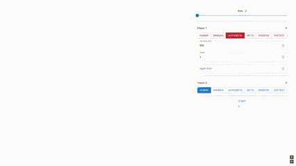

# **Pipopipette**



Un projet de jeu de pipopipette interactif développé en React, intégrant plusieurs types de joueurs (humains et intelligences artificielles) pour des parties captivantes.

## **Types de joueurs disponibles**

Le jeu permet de choisir parmi différents types de joueurs, qu'ils soient humains ou basés sur des algorithmes d'intelligence artificielle :

- **Humain** : Un joueur humain interagit via l'interface utilisateur.
- **Alphabeta** : IA utilisant l'algorithme Minimax avec élagage Alpha-Beta.
- **Minimax** : IA utilisant l'algorithme Minimax standard.
- **MCTS** : IA basée sur _Monte Carlo Tree Search_.
- **Fastest** : Sélectionne automatiquement la meilleure solution entre Alphabeta, Minimax et MCTS en fonction du temps.
- **Random** : Joue des coups aléatoires.
- **AlphaZero** : IA basée sur l'algorithme _AlphaZero_ (cassé).

## **Paramétrage des IA**

Les comportements des IA peuvent être ajustés via plusieurs paramètres pour s'adapter à vos besoins ou à vos expérimentations.

### **Paramètre général**

- **Temps minimum (ms)** : Temps minimum d'attente entre chaque coup joué par une IA pour simuler une réflexion (en millisecondes).

### **Paramètres spécifiques aux IA**

#### **Alphabeta & Minimax**

- **Depth (profondeur)** : Limite de profondeur pour l'exploration de l'arbre de recherche.
- **Depth limit** : Définit un seuil pour les coups multiples consécutifs.  
  Par exemple, si `depth limit = 2` et que l'IA peut jouer trois coups consécutifs, elle jouera deux coups avant de s'arrêter.

#### **MCTS (Monte Carlo Tree Search)**

- **Iterations** : Nombre total d'itérations du processus MCTS.
- **Simulations** : Nombre de simulations effectuées par itération.
- **C (paramètre d'exploration)** : Facteur d'exploration, influençant le compromis entre exploration et exploitation.

#### **AlphaZero**

- **iteration** : Nombre de simulations effectuées par itération.
- **model** : Modèle utilisé pour prédire les probabilités et les valeurs (SxS_F_B_I => S = taille, F = nombre de filtres, B = nombre de blocs, I = iteration meilleur que la précédente).

## **Comment utiliser le projet ?**

1. **Installation** : Clonez ce dépôt et installez les dépendances :
   ```bash
   git clone https://github.com/Energisse/POLYTECH-IA-PROJET-PIPOPIPETTE
   cd pipopipette
   npm install
   ```
2. **Lancer l'application** : Démarrez le serveur de développement :
   ```bash
   npm start
   ```
3. **Configurer les joueurs et IA** : Configurez les paramètres directement dans l'interface utilisateur ou dans les fichiers de configuration si nécessaire.

### **Auteur**

Développé avec ❤️ par Thomas.
